# Legal Chatbot for Indian Law using CrewAI and Groq

[](https://legal-multiagent-system.streamlit.app/)

This Streamlit application provides a legal chatbot specifically tailored for Indian law. It leverages the power of CrewAI to orchestrate multiple AI agents, providing users with relevant information and simplified explanations of complex legal topics. The application is designed to be user-friendly, allowing individuals without legal expertise to easily access and understand Indian legal concepts, procedures, and case laws. It uses Groq for faster and cheaper inference.

[Click here to access the deployed Streamlit app](https://legal-multiagent-system.streamlit.app/)

## Features

- **Interactive Chat Interface:** A Streamlit-based chat interface allows users to ask questions about Indian law in natural language.
- **AI-Powered Legal Information Retrieval:** CrewAI agents efficiently retrieve relevant information from legal documents using vector databases (FAISS) and embeddings.
- **Simplified Legal Summarization:** Complex legal concepts are translated into easy-to-understand language by specialized AI agents.
- **Conversation History:** The chatbot maintains a conversation history to provide more contextually relevant responses.
- **Groq Integration:** Utilizes Groq's fast inference service for efficient processing of legal queries.
- **Standalone CrewAI Execution:** Ability to run the CrewAI workflow directly from the command line without the Streamlit interface.

## Architecture Diagram

```mermaid
graph LR
    A("User Interface (Streamlit app.py)") --> B("User Input");
    B --> C{"CrewAI Framework"};
    C --> D("Query Agent (agents.py)");
    C --> E("Summarization Agent (agents.py)");
    D --> F("Retrieval Task (task.py)");
    E --> G("Summarization Task (task.py)");
    F --> H("Legal Retrieval Tool (tools.py)");
    H --> I{"FAISS Vector Database"};
    I --"PDF Documents"--> J("PDF Data Sources");
    J("PDFs: Lit. Guide, ICAI...");
    I --"Embeddings"--> K("HuggingFace Embeddings");
    K("all-MiniLM-L6-v2");
    I --"Query Similarity"--> H;
    H --"Relevant Sections"--> F;
    F --"Agent Selection"--> D;
    D --"Answer Synthesis"--> C;
    G --"Legal Info"--> E;
    E --"Plain Language Summary"--> C;
    C --> L("Assistant Response");
    L --> A;

    style A fill:#f9f,stroke:#333,stroke-width:2px,color:#000
    style B fill:#ccf,stroke:#333,stroke-width:2px,color:#000
    style C fill:#ccf,stroke:#333,stroke-width:2px,color:#000
    style D fill:#ccf,stroke:#333,stroke-width:2px,color:#000
    style E fill:#ccf,stroke:#333,stroke-width:2px,color:#000
    style F fill:#ccf,stroke:#333,stroke-width:2px,color:#000
    style G fill:#ccf,stroke:#333,stroke-width:2px,color:#000
    style H fill:#ccf,stroke:#333,stroke-width:2px,color:#000
    style I fill:#ccf,stroke:#333,stroke-width:2px,color:#000
    style J fill:#ccf,stroke:#333,stroke-width:2px,color:#000
    style K fill:#ccf,stroke:#333,stroke-width:2px,color:#000
    style L fill:#ccf,stroke:#333,stroke-width:2px,color:#000

    classDef box fill:#f9f,stroke:#333,stroke-width:2px;

```



## Installation

```sh
git clone [https://github.com/your_github_username/your_repo_name.git](https://github.com/ankitmishralive/legal-multiagent-system/)
cd your_repo_name
pip install -r requirements.txt
```

## Usage

### Running the Streamlit App

```sh
streamlit run app.py
```

### Running CrewAI Workflow Directly

```sh
python crew.py
```


[Click here to access the deployed Streamlit app](https://legal-multiagent-system.streamlit.app/)

## Environment Variables

Create a `.env` file in the root directory and add the following:

```ini
GROQ_KEY=your_groq_api_key
```

## Sample Output


## Technologies Used

- **Streamlit** - For building the chat interface
- **CrewAI** - For orchestrating AI agents
- **FAISS** - Vector database for efficient document retrieval
- **Groq** - High-performance inference service
- **gemma2-9b-it** - Open source Large Language model for generating responses

## Contributing

Contributions are welcome! Please follow these steps:

1. Fork the repository.
2. Create a new branch (`feature/your-feature`).
3. Commit your changes.
4. Push to your fork and create a pull request.

## License

This project is licensed under the MIT License - see the [LICENSE](LICENSE) file for details.

## Contact

For any inquiries or support, please reach out:

- **Email:** ankitmishra.letter@gmail.com
- **GitHub:** [ankitmishralive](https://github.com/ankitmishralive)

